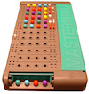

# Mastermind API
[](https://travis-ci.org/eballo/mastermind)
[](https://coveralls.io/github/eballo/mastermind?branch=master)



## Introduction

__Mastermind__ is a code-breaking game for two players. One player becomes the _codemaker_, the other the _codebreaker_. 
The _codemaker_ chooses a pattern of four color code pegs (duplicates allowed) and the _codebreaker_ tries to guess it, in both order and color.
Each guess is made by placing a row of color code pegs on the decoding board. Once placed, the codemaker provides feedback by placing from zero to four key pegs in the small holes of the row with the guess. A black key peg (small red in the image) is placed for each code peg from the guess which is correct in both color and position. A white key peg indicates the existence of a correct color code peg placed in the wrong position.

_Example: Given a code __[RED, BLUE, GREEN, RED]__ when the codebreaker gives a code with __[RED, GREEN, RED, YELLOW]__ the feedback will be: 1 black, 2 whites._

For more information about the game: 

https://en.wikipedia.org/wiki/Mastermind_(board_game)
 
## Project requirements

We want a Rest API that simulates the role of the Masterminds codemaker, its main features are:

- Create game (given a user request)
- Return feedback given a code guess
- Check game historic (optional, actually is a role of the board not the codemaker)
- The code should be production ready
- Use git for versioning (commits and documentation will be valuated)
- The code can be written in any language or framework (but python is preferred)
- Once finished send us a link to the remote git repository where it’s stored (Github, bitbucket, gitlab etc.)
- This project should take between 6-8h

## How to Start the project
Go to the app directory and run the following command

```
cd mastermind-app

mvn clean install spring-boot:run
```

## Available end points

```
http://localhost:8080/swagger-ui.html#/
```


## How to play
To play the mastermind API game:

- Create a game
	- Some configurations can be done (codelength, duplicates, number of guesses)
- create a codemaker for this gameId
	- Create a random using the GET
	- Create your own one using POST
- Start playing sending the codebreaker for this gameId
   - Send a POST with your code Pegs with the same number of pegs as the game configuration.

Sample Game response:

```
{
  "id": "a1d829de-3dcb-4302-9434-0257d5e81e2e",
  "finished": "true",
  "win": "true",
  "gameConfiguration": {
    "guesses": 11,
    "duplicates": false,
    "codeLength": 4
  },
  "guessNum": 4,
  "privateCode": [
    "ORANGE",
    "YELLOW",
    "BLUE",
    "GREEN"
  ],
  "history": {
    "0": {
      "codePegs": [
        "BLUE",
        "BLUE",
        "BLUE",
        "BLUE"
      ],
      "keyPegs": [
        "WHITE",
        "WHITE",
        "BLACK",
        "WHITE"
      ]
    },
    "1": {
      "codePegs": [
        "BLUE",
        "BLUE",
        "BLUE",
        "YELLOW"
      ],
      "keyPegs": [
        "WHITE",
        "WHITE",
        "BLACK",
        "WHITE"
      ]
    },
    "2": {
      "codePegs": [
        "BLUE",
        "BLUE",
        "ORANGE",
        "YELLOW"
      ],
      "keyPegs": [
        "WHITE",
        "WHITE",
        "WHITE",
        "WHITE"
      ]
    },
    "3": {
      "codePegs": [
        "ORANGE",
        "YELLOW",
        "BLUE",
        "GREEN"
      ],
      "keyPegs": [
        "BLACK",
        "BLACK",
        "BLACK",
        "BLACK"
      ]
    }
  }
}
```

Server sample response

```
{
  "activeGames": 1,
  "totalGames": 2,
  "finishedGames": 1,
  "gameList": [
    {
      "id": "67232e9f-f0da-49f8-a806-49232bfd54e0",
      "finished": "false",
      "gameConfiguration": {
        "guesses": 11,
        "duplicates": false,
        "codeLength": 4
      },
      "guessNum": 0,
      "history": {}
    },
    {
      "id": "a1d829de-3dcb-4302-9434-0257d5e81e2e",
      "finished": "true",
      "win": "true",
      "gameConfiguration": {
        "guesses": 11,
        "duplicates": false,
        "codeLength": 4
      },
      "guessNum": 4,
      "privateCode": [
        "ORANGE",
        "YELLOW",
        "BLUE",
        "GREEN"
      ],
      "history": {
        "0": {
          "codePegs": [
            "BLUE",
            "BLUE",
            "BLUE",
            "BLUE"
          ],
          "keyPegs": [
            "WHITE",
            "WHITE",
            "BLACK",
            "WHITE"
          ]
        },
        "1": {
          "codePegs": [
            "BLUE",
            "BLUE",
            "BLUE",
            "YELLOW"
          ],
          "keyPegs": [
            "WHITE",
            "WHITE",
            "BLACK",
            "WHITE"
          ]
        },
        "2": {
          "codePegs": [
            "BLUE",
            "BLUE",
            "ORANGE",
            "YELLOW"
          ],
          "keyPegs": [
            "WHITE",
            "WHITE",
            "WHITE",
            "WHITE"
          ]
        },
        "3": {
          "codePegs": [
            "ORANGE",
            "YELLOW",
            "BLUE",
            "GREEN"
          ],
          "keyPegs": [
            "BLACK",
            "BLACK",
            "BLACK",
            "BLACK"
          ]
        }
      }
    }
  ]
}
```

## TODO :
- Create a client
- Integration Tests