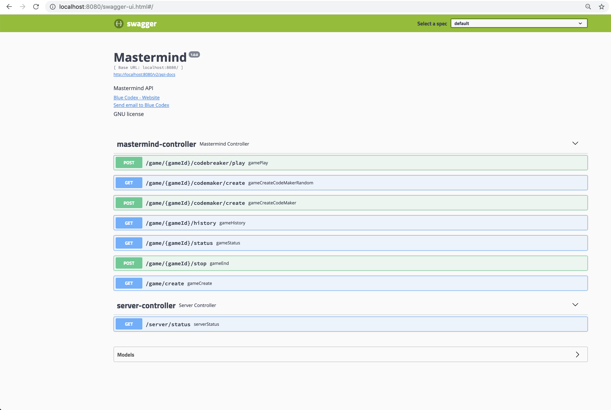

# Mastermind API
[](https://travis-ci.org/eballo/mastermind)
[](https://coveralls.io/github/eballo/mastermind?branch=master)


## Introduction
Mastermind or Master Mind is a code-breaking game for two players. The modern game with pegs was invented in 1970 by Mordecai Meirowitz, an Israeli postmaster and telecommunications expert.[1][2] It resembles an earlier pencil and paper game called Bulls and Cows that may date back a century or more.

https://en.wikipedia.org/wiki/Mastermind_(board_game)

In this project we want to to create a Mastermind API to be able to play this game.

## How to Start the project
Go to the app directory and run the following command

```
cd mastermind-app

mvn clean install spring-boot:run
```

## Available end points

```
http://localhost:8080/swagger-ui.html#/
```


## How to play
To play the mastermind API game:

- Create a game
	- Some configurations can be done (codelength, duplicates, number of guesses)
- create a codemaker for this gameId
	- Create a random using the GET
	- Create your own one using POST
- Start playing sending the codebreaker for this gameId
   - Send a POST with your code Pegs with the same number of pegs as the game configuration.

Sample Game response:

```
{
  "id": "a1d829de-3dcb-4302-9434-0257d5e81e2e",
  "finished": "true",
  "win": "true",
  "gameConfiguration": {
    "guesses": 11,
    "duplicates": false,
    "codeLength": 4
  },
  "guessNum": 4,
  "privateCode": [
    "ORANGE",
    "YELLOW",
    "BLUE",
    "GREEN"
  ],
  "history": {
    "0": {
      "codePegs": [
        "BLUE",
        "BLUE",
        "BLUE",
        "BLUE"
      ],
      "keyPegs": [
        "WHITE",
        "WHITE",
        "BLACK",
        "WHITE"
      ]
    },
    "1": {
      "codePegs": [
        "BLUE",
        "BLUE",
        "BLUE",
        "YELLOW"
      ],
      "keyPegs": [
        "WHITE",
        "WHITE",
        "BLACK",
        "WHITE"
      ]
    },
    "2": {
      "codePegs": [
        "BLUE",
        "BLUE",
        "ORANGE",
        "YELLOW"
      ],
      "keyPegs": [
        "WHITE",
        "WHITE",
        "WHITE",
        "WHITE"
      ]
    },
    "3": {
      "codePegs": [
        "ORANGE",
        "YELLOW",
        "BLUE",
        "GREEN"
      ],
      "keyPegs": [
        "BLACK",
        "BLACK",
        "BLACK",
        "BLACK"
      ]
    }
  }
}
```

Server sample response

```
{
  "activeGames": 1,
  "totalGames": 2,
  "finishedGames": 1,
  "gameList": [
    {
      "id": "67232e9f-f0da-49f8-a806-49232bfd54e0",
      "finished": "false",
      "gameConfiguration": {
        "guesses": 11,
        "duplicates": false,
        "codeLength": 4
      },
      "guessNum": 0,
      "history": {}
    },
    {
      "id": "a1d829de-3dcb-4302-9434-0257d5e81e2e",
      "finished": "true",
      "win": "true",
      "gameConfiguration": {
        "guesses": 11,
        "duplicates": false,
        "codeLength": 4
      },
      "guessNum": 4,
      "privateCode": [
        "ORANGE",
        "YELLOW",
        "BLUE",
        "GREEN"
      ],
      "history": {
        "0": {
          "codePegs": [
            "BLUE",
            "BLUE",
            "BLUE",
            "BLUE"
          ],
          "keyPegs": [
            "WHITE",
            "WHITE",
            "BLACK",
            "WHITE"
          ]
        },
        "1": {
          "codePegs": [
            "BLUE",
            "BLUE",
            "BLUE",
            "YELLOW"
          ],
          "keyPegs": [
            "WHITE",
            "WHITE",
            "BLACK",
            "WHITE"
          ]
        },
        "2": {
          "codePegs": [
            "BLUE",
            "BLUE",
            "ORANGE",
            "YELLOW"
          ],
          "keyPegs": [
            "WHITE",
            "WHITE",
            "WHITE",
            "WHITE"
          ]
        },
        "3": {
          "codePegs": [
            "ORANGE",
            "YELLOW",
            "BLUE",
            "GREEN"
          ],
          "keyPegs": [
            "BLACK",
            "BLACK",
            "BLACK",
            "BLACK"
          ]
        }
      }
    }
  ]
}
```

## TODO :
- Create a client
- Integration Tests